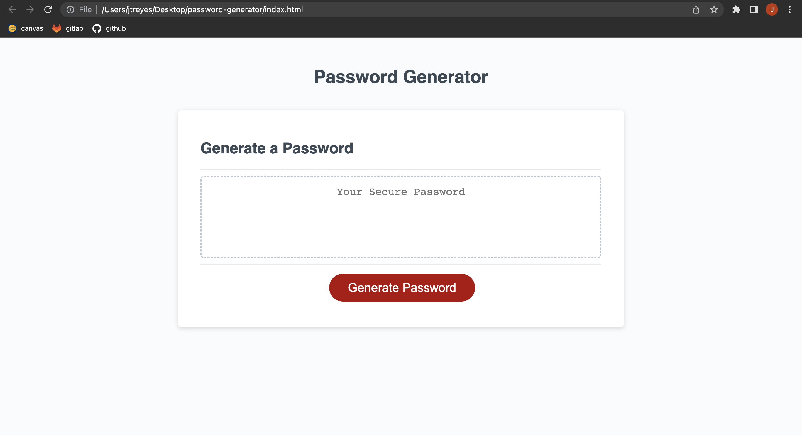

# Password Generator

## Technology Used 

| Technology Used         | Resource URL           | 
| ------------- |:-------------:| 
| Javascript    | [https://developer.mozilla.org/en-US/docs/Web/JavaScript](https://developer.mozilla.org/en-US/docs/Web/JavaScript) | 
| Javascript     | [https://www.w3schools.com/js/default.asp](https://www.w3schools.com/js/default.asp)      |   
| Special Chars | [https://owasp.org/www-community/password-special-characters](https://owasp.org/www-community/password-special-characters) |

## Description 

[Visit the Deployed Site](https://jesustgr.github.io/password-generator/)

This task required me to create an application that a user can use to generate a random password based on criteria they've selected. This app runs in the browser, and features dynamically updated HTML and CSS powered by JavaScript code that I wrote. It has a clean and polished user interface that is responsive, ensuring that it adapts to multiple screen sizes.

In this code, the generatePassword() function handles the series of prompts for password criteria and validates user input. It calls the getPasswordLength() function to prompt the user for the desired password length and ensure it is within the valid range (8 to 128 characters).

The generatePassword() function then uses confirm() to prompt the user for each character type and stores the user's selections. If the user does not select at least one character type, an alert is displayed, and an empty password is returned.

The generateRandomPassword() function generates a random password based on the selected criteria. It builds a charset string by concatenating the character sets for the selected character types. Then, it iterates length number of times, randomly selecting characters from the charset to form the password.

Finally, the generated password is returned to the writePassword() function, which sets the value of the #password input field on the page.

## Screenshot

## Usage 

What the user first sees is the screenshot above. All they must do is click the "Generate Password" button to get started. They are then prompted to enter a password length from 8 to 128. If the user enters a number smaller or larger than that, they are given this alert: "Please enter a valid password length between 8 and 128 characters." After entering a valid passsword length, they are then prompted to confirm which types of characters they would like to include in their password. The character types are UPPERCASE, LOWERCASE, NUMERIC, and SPECIAL. Once the user makes their selections, a "random" password based on the parameters they set themselves is created and displayed in the box above the button.

## Learning Points 

My biggest takeaway from completing this task is the importance of CALLING a function. It is one thing writing a function, but if one never calls it, it is essentially there for no reason. I like to think of variables as the ingredients, the function itself as the recipe, and the act of calling the said function as COOKING!

## Author Info

### Jesus Thomas Reyes 

* [Portfolio](https://jesustgr.github.io/my-portfolio/)
* [LinkedIn](https://www.linkedin.com/in/jesus-thomas-reyes-aa001a192/)
* [Github](https://github.com/jesustgr)
